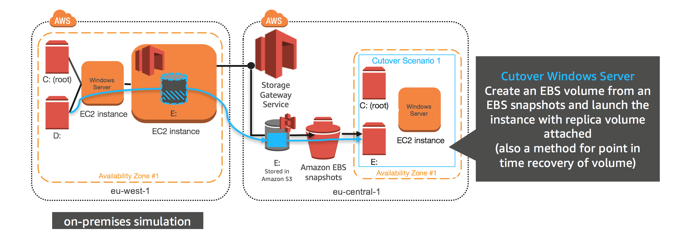

## AWS Hybrid Storage Workshop

## License

This library is licensed under the Amazon Software License.

## Introduction

This workshop shows you how to work with the AWS storage gateway service in both file and volume mode. The storage gateway service is ideal for hybrid deployments and migration solutions are looking the bridge traditional on-premises servers and storage protocols with cloud native services such as Amazon S3 and Amazon EBS. The workshop is broken into two independent scenarios.

## Scenario 1 – Volume Gateway

In this scenario, you will use AWS Storage Gateway to migrate a block based volume from one AWS Region (eu-west-1) to other regions (eu-west-2 and eu-central-1). This will simulate the process you would follow to migrate data volumes from a non-AWS datacenter to AWS as well, with the eu-west-1 (Ireland) region representing the non-AWS datacenter. You will migrate the data using two different methods.

You will first migrate the data by copying it to an AWS Storage Gateway volume mounted in eu-central-1.  You will then mount a copy of the volume and its data to an EC2 instance in eu-west-2 by leveraging storage gateways ability to generate EBS snapshots from block data stored in S3 and EC2s ability to mount volumes generated from EBS snapshots.

You will then deploy a second AWS Storage Gateway in a remote region (eu-west-2), and mount a volume cloned from the origin Volume Gateway that is hosted in eu-central-1 to an EC2 instance in the destination region. The effect is the same in both methods, you will have a Windows server in the destination region with a data volume that matches the data volume from the original region.

In this scenario, you will leverage S3, AWS Storage Gateway (volume cached mode), EC2 Windows Instances, Security Groups and Cloud formation (to automate deployment of some components)

## Scenario 2 – File Gateway

In this scenario, you will configure AWS Storage Gateway to create an NFS connection from a Linux instance to an S3 bucket located in a remote region. This simulates AWS Storage Gateways ability to present an NFS mount point to a private datacenter, whilst storing any files written in S3 as durable objects in an S3 bucket of your choosing.

This scenario will also step you though configuring advanced S3 features S3 Lifecycle Policies and Cross Region Replication (CRR). Leveraging Lifecycle Policies can reduce the cost of storing objects, whilst CCR allows objects to be stored in multiple regions. 

Files that you write to the NFS interface in eu-west-1 will be accessible from the NFS mount point on your Linux instance and both a primary and secondary bucket in independent AWS regions.

