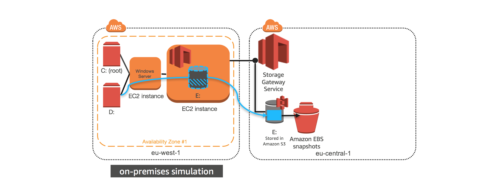
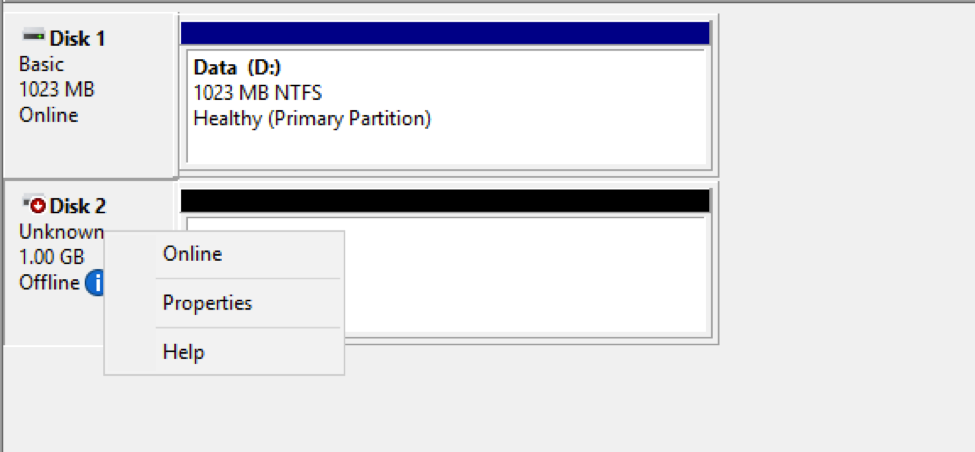

#  Migrate data to an AWS Storage Gateway volume

## Introduction

In this module, you will deploy a Volume Gateway that will allow your data to be replicated to the Frankfurt region (AWS). You will deploy the gateway into the Ireland region in the same Availability Zone as the Windows instance you launched in Module 1. The gateway is registered in the Frankfurt region, however, and that is where the data will be stored for all volumes created on this gateway. 

You will launch this AWS CloudFormation template in the eu-west-1 region to build the necessary resources automatically. This template will create a Storage Gateway in the Frankfurt (eu-central-1) region, but deploy it in EC2 in the Ireland region so it can be attached to your new Windows instance. The gateway will be activated by the template and the appropriate security group will be attached.

## Architecture overview



### 1.	Deploy Windows Instance using CloudFormation Template

<details>
<summary><strong>CloudFormation Launch Instructions (expand for details)</strong></summary><p>

1.	Right click the **Launch Stack** link below and "open in new tab"

Region| Launch
------|-----
EU (Ireland) | [](https://console.aws.amazon.com/cloudformation/home?region=eu-west-1#/stacks/new?stackName=storage-workshop-1b&templateURL=https://s3-us-west-2.amazonaws.com/hybrid-storage-workshop/scenario1-step2-migrate-SGW1-(eu-west-1).json)

2. Click **Next** on the Select Template page.
3. Select your default VPC and any one of the subnets within that VPC.
4. Leave Instance Type, Gateway Cache Disk Size and Gateway Upload Buffer Disk Size at default values.
5. Choose a size between 1GiB and 10GiB for the volume that will be presented by the gateway and stored in Frankfurt. 
Note: We have kept the volume sizes small to reduce cost of the storage for this workshop, in the real world volumes are much larger.
7. Leave the Activation Region at eu-central-1
8. Select the Security Group that was created in Module 1 named "storage-workshop-1a-win1SecurityGroup...". This will allow our windows instance network access (iSCSI) to the gateway that is soon to be deployed in the same VPC.
9.	Click **Next**.
10.	Click **Next** Again. (skipping IAM advanced section)
11.	On the Review page, check the box to acknowledge that CloudFormation will create IAM resources and click **Create**.


Once the CloudFormation stack shows a status of CREATE_COMPLETE, you are ready to move on to the next step.
</p></details>

## 2. Verify the gateway is active and get its IP Address

<details>
<summary><strong>Verify gateway and get IP (expand for details)</strong></summary><p>

1. From the **Services** drop-down, select **EC2**.
2. You should see a new c4.2xlarge instance with the name "Hybrid Workshop - Migrate - Gateway Server 1 (storage-workshop-1b)"  in a *running* state.
3. Refresh the instance view periodically (every 30 seconds) until you see the word *Activated* in the EC2 instance name.
4. From the Services drop-down, select **Storage Gateway**.

Note: You will not see the gateway that was just provisioned here. While, we deployed the gateway into EC2 in the EU (Ireland) region, the gateway was activated in the EU (Frankfurt) region, so that is where we will find the gateway, and that is where the data written to it will be stored.

5.	Click on **Ireland** in the upper-right corner and select **EU (Frankfurt)** from the list to switch the console to the eu-central-1 region.

You will now see the Gateway that you just provisioned listed. Verify that their is a gateway named "Hybrid-Workshop-Gateway-Server-1...." and its status is *Running*.

6.	Click on the gateway to reveal the Details tab below. From the Details tab, make note of the *IP address* of the gateway and write it below. (We will use that address to connect our windows client to the storage gateways iSCSI interface.

7.	Click Volumes from the left menu to see the volume that was created by the CloudFormation stack. The size should match what you specified in the configuration (1-5 GiB).
</p></details>

## 3. Connect the windows server to the gateway volume

Now comes the fun part! We will now attach the volume from your Volume Gateway Service in Frankfurt to your Windows instance in Ireland, giving that instance access to both local EBS storage in that Ireland at the same time as remotely write data to Frankfurt via the gateway volume.

<details>
<summary><strong>Connect windows to gateway (expand for details)</strong></summary><p> 

1. Return to your Windows instanceRDP sesssion and open the iSCSI Initiator utility by clicking the Windows logo in the bottom left corner and typing ‘iscsi’ and then clicking iSCSI Initiator from the search results.

2. Click ‘Yes’ if prompted to enable the iSCSI service in Windows


3.	In the Targets tab of the iSCSI Initiator Properties window, enter the *IP address* that you wrote down for your Volume Gateway in the Quick Connect section and click the **Quick Connect** button. 

You should see a target listed now with Connected status:


Your Windows instance is now connected with the Volume Gateway via iSCSI and the only volume that exists has been discovered by Windows and connected.

5. Click **OK** to close the iSCSI Initiator Properties window.

</p></details>

## 3. Format AWS Storage Gateway Volume

<details>
<summary><strong>Format AWS Storage Gateway Volume (expand for details)</strong></summary><p>

Now we need to create a filesystem for our cloud backed volume.

1. Right click on the windows start menu in the lower left corner and select **Disk Management**.

Note: You will see a new Offline Disk 2 of Unknown type. This is your Volume Gateway cached volume. Since Volume Gateway is presenting the volume as raw block storage (like a new SAN volume would look in a traditional datacenter), we need to bring it online and format it so Windows can use it.

2. To format the new volume, first we need to bring it online by right-clicking the section describing the disk and selecting **Online**.



3.	After it is online, right-click the disk again and select **Initialize Disk**. Leave all the default settings and click **OK**.
3.	Now click in the blank white space of the disk and select **New Simple Volume**.
4.	Click **Next** on the first page of the New Simple Volume Wizard.
5.	Leave the default to allocate all available storage to the new volume and click **Next**.
6.	Leave the default setting to mount the new volume as the E: drive and click **Next**.
7.	Leave the default settings of NTFS and the Default unit allocation size. You can change the Volume Label if you’d like, leave the box checked for Quick Format, and click **Next** and then **Finish** to format the disk.
8.	You can now open File Explorer and see the new E: drive. 

</p></details>

## 4. Copy the sample data from the D: volume to the gateway backed (hybrid) E: volume

Let’s copy our data over to the gateway volume. 

<details>
<summary><strong> Copy data from local to hybrid storage (expand for details)</strong></summary><p>

1. Open Command Prompt and use robocopy to mirror your D: drive to the newly mounted E: drive:

```
robocopy d: e: /MIR
```

2. Check the E: drive in File Explorer and you should see all of the data that was on D: also on E: now. 

### What just happened?

When you copied the data from the D: drive to the E: drive within your Windows instance, underneath Windows, you copied the data from your Windows instance’s EBS volume to the Volume Gateway. When this happened, the gateway received the data into its local cache, and then began to copy the data up to S3 in the Frankfurt (eu-central-1) region via its local Upload Buffer automatically. Pretty cool, huh?

3. From File Explorer, see how much data is on the E: drive. 

</p></details>

## 5. Create and EBS snapshot of the Storage Gateway volume.

Now, let’s create an EBS snapshot of this volume so we can have a point in time copy that can be shared with EC2 instance in the Frankfurt region.

1. Your web management console should still be in the Storage Gateway service in the Frankfurt region, but if not, navigate back there.
2. Click on the volume in the Volumes section. You’ll see that there’s now some usage on the volume that’s reflected in the console. Of course, we expected that…

## Validation Step

<details>
<summary><strong>Verify your EBS snapshot is being created (expand for details)</strong></summary><p>

1. From the Actions drop-down, select **Create EBS Snapshot**. Enter a description for the snapshot (ex. Data migrated from Windows server to AWS), and click **Create EBS snapshot** button.
2.	From the **Services** drop-down, select **EC2** to return to the EC2 management console. Then select Snapshots from the left menu. Our new snapshot will probably still be *pending* so we’ll wait for it to finish.

Note: The EBS snapshot size matches the size of the volume, not the amount of data created. So, when you create a volume from a snapshot, you know how large the volume will need to be to host the nested filesystem and partion. However, underneath, only the actual data blocks are stored, saving you money!

After this module, you have added to your architecture a new EC2 instance in the Ireland (eu-west-1) region which is your Frankfurt backed Volume Gateway. It has four EBS volumes:

* 1 x 80 GiB volume for the gateway O/S
* 1 x 10 GiB volume for the local cache
* 1 x 10 GiB volume for the upload buffer

Your Volume Gateway was configured with one cached volume, and we took a snapshot of that volume in the Frankfurt region. 

In the next module you’ll deploy a Windows server in AWS (Frankfurt) with the snapshot data attached, effectively migrating your server and its data.

</p></details>

### Start next module

Module 3: [Cutover data volume to Amazon EBS in eu-central-1](../module-3/README.md)

## License

This library is licensed under the Amazon Software License.

[Back to the main workshop scenarios page](../../README.md)
