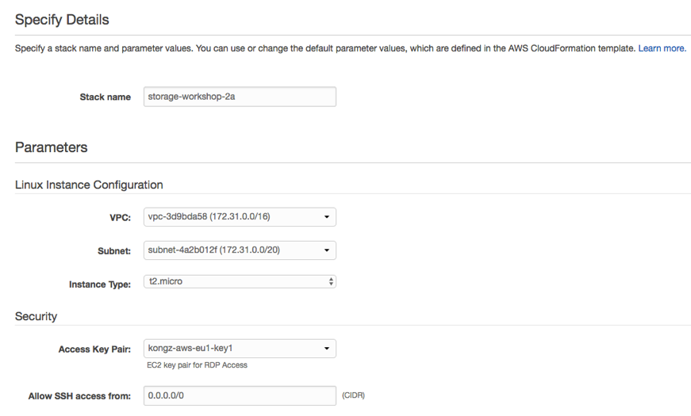
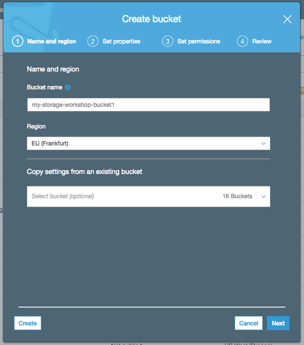
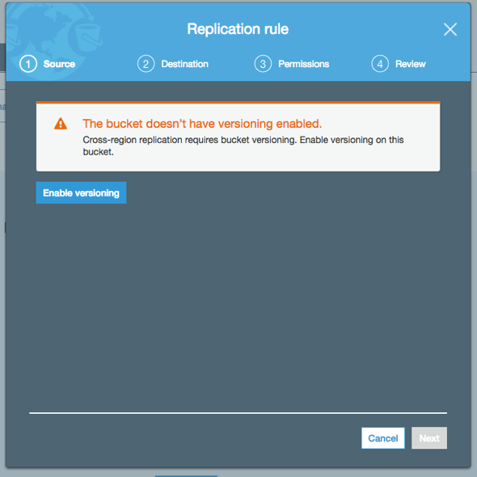
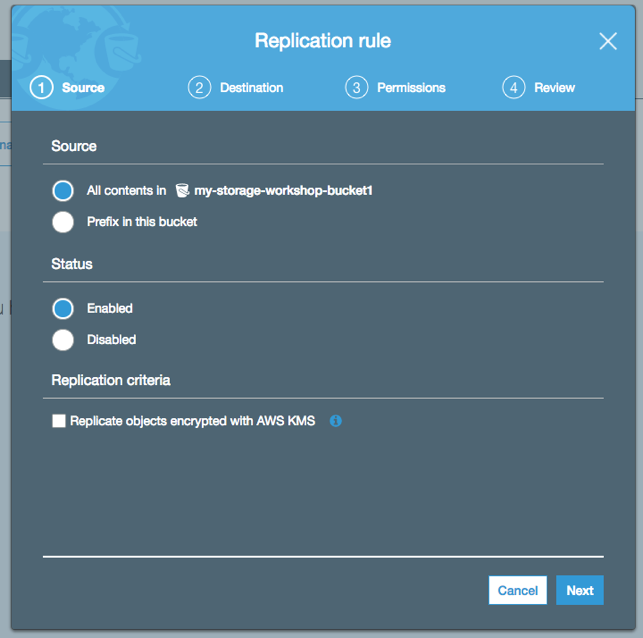
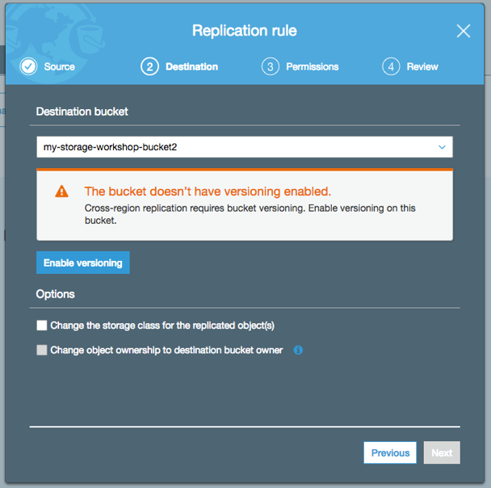
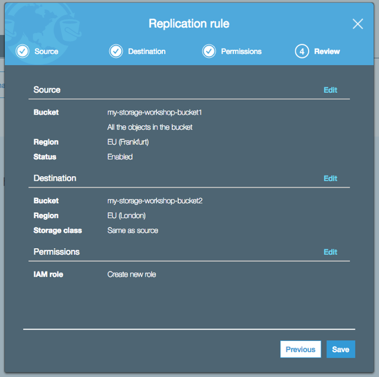
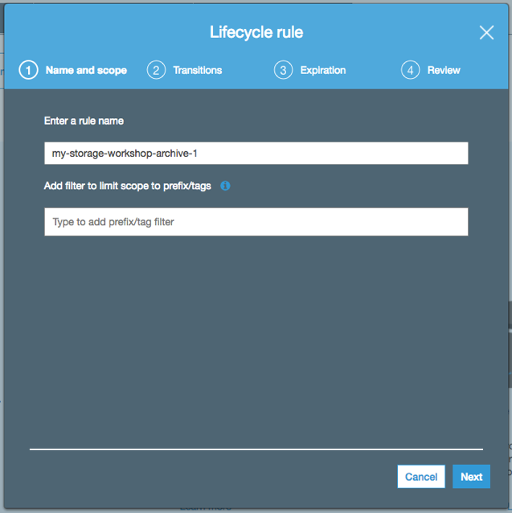
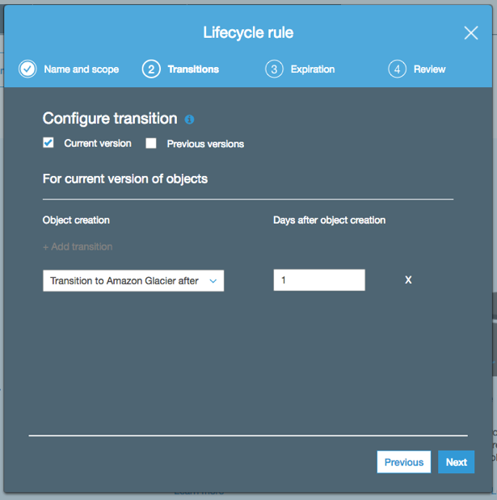
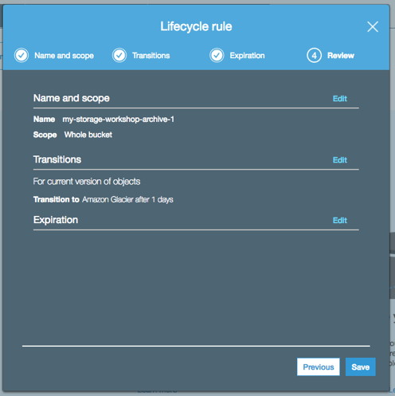
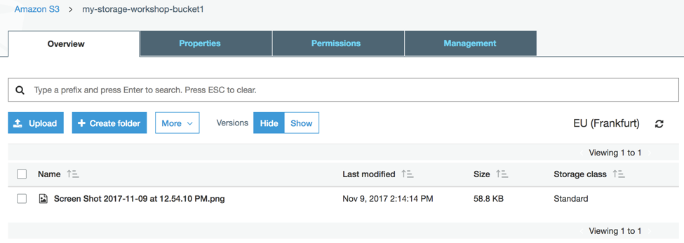

# Deploy Linux Instance & configure S3 Storage Solution with CRR and Lifecycle Policy

## License

This library is licensed under the Amazon Software License.

## Introduction

In this module, you will deploy a Linux EC2 instance to simulate on-premises server with a root EBS volume with media data on it in the eu-west-1 (Ireland) AWS region. You will also create two S3 buckets in two different regions and configure advanced S3 features: S3 Lifecycle Policies and Cross Region Replication (CRR).

## Architecture Overview

The EC2 instance in eu-west-1 is to simulate the physical server in on-premises data center and will be used in next module to use an on-premises file storage gateway solution.  The EC2 instance use EBS volume as root volume with file data. 

S3 bucket for file gateway will be created in eu-central-1, which is the primary data backup location. Another S3 Bucket in eu-west-2 will be created as the replica copy of S3 file as part of a Data Recovery solution.  Cross-region replication will be enabled on the primary S3 bucket to replicate the same data to the replica S3 bucket.  Primary S3 bucket will be used in module 2 as part of file storage gateway service. 

In addition, S3 lifecycle policy will be created to change the data older than 30 days in S3 replica bucket from S3 standard class to S3 Glacier class to save the cost.   

## Implementation Instructions

### 1.	Deploy Linux Instance using CloudFormation Template

The first step is to deploy an EC2 instance with some data in eu-west-1 to simulate a Linux server running in a non-AWS location.

You can launch a customized instance using the following AWS CloudFormation template in the eu-west-1. The template will launch an instance, download a sample dataset to the instance and setup a security group for ssh access.

<strong>CloudFormation Launch Instructions (expand for details)</strong>

1.	Right click the **Launch Stack** link below and "open in new tab"

Region| Launch
------|-----
EU (Ireland) | .json)

2. Click **Next** on the Select Template page.
3. Select your default VPC and any one of the subnets within that vpc.  Note the subnet need to have a IGW attached.
4. If you already have an Access Key Pair for this region that you have access to, enter that key pair.  Otherwise, you will need to create a new key pair. [creating a key pair using amazon EC2](http://docs.aws.amazon.com/AWSEC2/latest/UserGuide/ec2-key-pairs.html#having-ec2-create-your-key-pair)
5. Leave the Allow SSH access from as 0.0.0.0/0 or enter the public IP of the computer from which you plan to access the Windows server.  You can find your public IP address at http://www.whatismypublicip.com/
6. Click **Next**.

7. You can leave the IAM role and Advanced section
8. Click **Next**
9. On the Review page, check the box to acknowledge that CloudFormation will create IAM resources and click **Create**. 

Once the Cloudformation Stack shows a status of **CREATE_COMPLETE**, you can continue to the next step

### 2.	SSH into Linux Instance created earlier and List the data
SSH into the Linux instance that is just created, and list the files under /media/data. There are 200 JPEG files uploaded there. 

<strong>Step-by-step instructions (expand for details)</strong>

1. From the AWS Console, select EC2 in Services Tab, find the instance created by previous CloudFormation Stack.  The instance should have a name start with  “Hybrid Workshop – Deploy – Linux Server 1”. Write down the IPv4 Public IP in Description. 
2. Connect to the above Linux Instance. For detailed instruction, please refer to Connecting to Your Linux Instance Using SSH
3. In the Linux OS, type `cd /media/data`
4. Type `ls –l`, you should see 200 image files, which make up our sample data

### 3. Create first S3 buckets in EU-Central-1
Use the AWS console to create your primary S3 bucket located in a remote region from your Linux instance (eu-central-1)

<strong>Step-by-step instructions (expand for details)</strong>

1. Changed the AWS console region to eu-central-1
2. In the AWS Management Console select **Services** then select **S3** under Storage.
3. Select **Create Bucket**
4. Provide a globally unique name for your bucket such as my-storage-workshop-bucket1.
5. Select the Region to EU (Frankfurt)
6. Choose **Create** in the lower left of the dialog without.

### 4. Create second S3 bucket in EU-West-2
Use the AWS console to create a secondary S3 bucket in a tertiary region (eu-west-2)

<strong>Step-by-step instructions (expand for details)</strong>

1. In the AWS Management Console select **Services** then select **S3** under Storage.
2. Select **+Create Bucket**
3. Provide a globally unique name for your bucket such as my-storage-workshop-bucket2.
4. Select the Region to EU (London)
5. Choose **Create** in the lower left of the dialog.

### 5. Setup Cross-region Replication from S3 Primary bucket to the secondary S3 bucket
Use the AWS console to enable cross-region replication on S3 primary bucket to S3 secondary bucket in another region. 

<strong>Step-by-step instructions (expand for details)</strong>

1. In AWS Management Console, S3 service, all the buckets are listed. Click the name of the S3 bucket you created in Step 3. 
2. Click Management Tab, and click Replication
3. Click **Get started**, the Replication Rule will display a window to ask Enable versioning

4. Click **Enable Versioning**, the Replication rule window goes to Step 1 - Source,  select source as All contents and select Enabled for Status.  Will leave the KMS encryption uncheck in this case. 

5. Click Next, Replication rule windows goes to step 2 – Destination.  Click the input box under Destination bucket and a drop-down list will display all the existing buckets in this account.  Select the S3 bucket that was created in eu-west-2

6. Another warning window will display to ask to Enable versioning on S3 bucket . Click **Enable versioning**.

7. Once Versioning is enabled, leave the option unchecked and click **Next**
8. The Replication rule move to Step 3 – Permissions. Click the input box under **Select IAM Role**, and select create new role. 
9. In Step 4 – review window. Click **Save.**

10.	You should see a rule under Replication tab.

### 6. Setup S3 Lifecycle Policy on S3 secondary bucket
Use the AWS Management Console to create a new lifecycle policy on S3 secondary bucket to remove old data to Glacier.

<strong>Step-by-step instructions (expand for details)</strong>

1. In AWS Management Console, S3 service, all the buckets are listed. Click the name of  the S3 secondary bucket you created in Step 3. 
2. Click Management Tab, and click Lifecycle
3. Click Get started or **+Add lifecycle rule**
4. In the first step of Lifecycle Rule Window, enter a rule name, click **Next**

5. In the second step of Lifecycle Rule Window to configure Transitions. Check the Current version, and click + Add transition.  Select “Transition to Amazon glacier after” and add “30” in Days after object creation. 

6. In step 3 of Lifecycle Rule, leave all the option unchecked. Click **Next**
7. In review window,  click **Save.** 

## Implementation Validation
1. 	Using either the AWS Management Console or AWS Command Line Interface, copy a test file to the Amazon S3 primary bucket created in the section 3.
You can either upload it using the AWS Management Console, or you use the AWS CLI to copy it directly on:
`aws s3 cp YOU_LOCAL_FILE s3://YOUR_BUCKET_NAME_HERE`

2. Select the S3 secondary bucket created in section 4 after a few minutes.  Click the refresh button, you should see the same file replicated to the second bucket. 

Congratulations, you now have a Linux instance in eu-west-1, a primary bucket in eu-central-1 and a replicated bucket in eu-west-2. When you are ready you can move to the second module.

[Deploy Storage Gateway in File mode and integrate with S3](../module-2/README.md)
